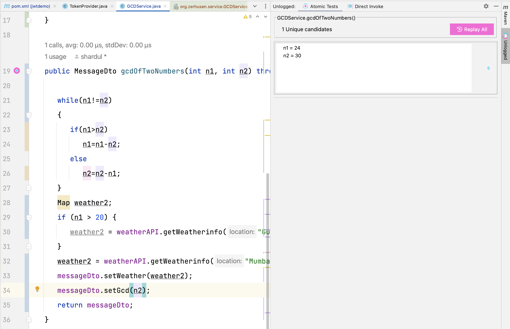
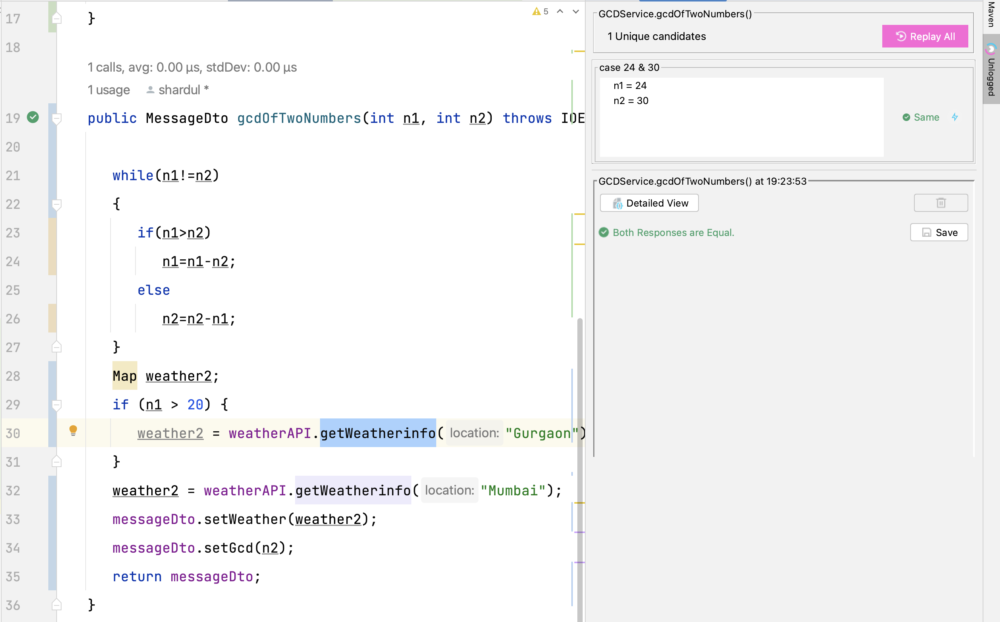
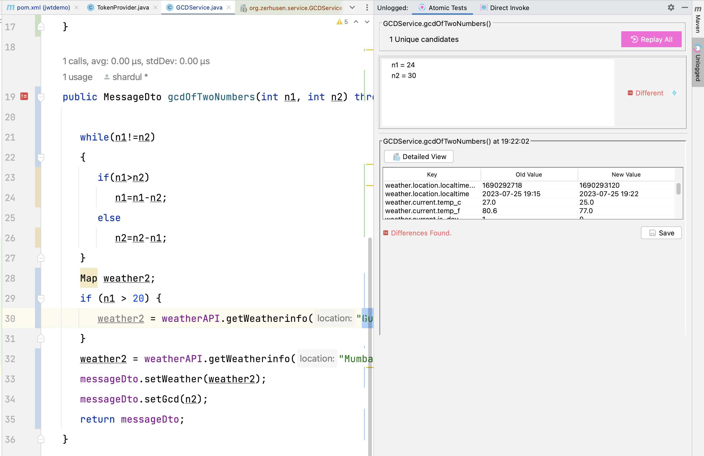

# Guttor Icons & What they mean

Once you install Unlogged, for each method in your code base, you will see different guttor icons. The code, record, replay lifecycle revolves around these 7 gutter icons. 

Here are different gutter icons and what they mean

!!! noprocess "Application Not Running with Unlogged"

    This icon means that your application is not running with Unlogged. You can add the Unlogged dependency in your pom.xml or build.gradle, mvn clean or gradle clean and start debugging your application.
 
Check [Getting Started](index.md) section to know how to add the dependency.

!!! process "Application Running with Unlogged"

    Once you see this icon, it means that your application is running with Unlogged. Now, you can invoke any method inside your Java code using Direct Invoke or call http end points using Postman, Swagger or UI.

Use Postman, Swagger in case you are accessing these methods through http end points. You can even use your UI to send data to your application. 

You can use ```Direct Invoke``` inside the plugin to call any Java method directly. This will save you a lot of time in debugging deep within your code. You can start debugging your methods right where it matters.

!!! recording "Recording Available for methods"

    Once you execute a method, using either Direct Invoke, Postman, or Swagger, you will see this icon. It indicates that Unlogged has recorded input and return values for the method. 

Click on the icon and you can check the recorded data



!!! bolt "Execute Method"

    If you make code changes after a recording is done for a method, you will see a bolt icon. That means you can now hot-relaod the code changes within this method and replay its previously recorded inputs.

Note the code changes in getWeatherinfo in the above vs below code snippet.


!!! nodifference "Passing Case"
    
    After your code changes, and once you execute the method, this icon tells you if the return value is same as before. 



!!! difference "Failing Case"

    After your code changes, and once you execute the method, this icon tells you if the return value is different from before. 

