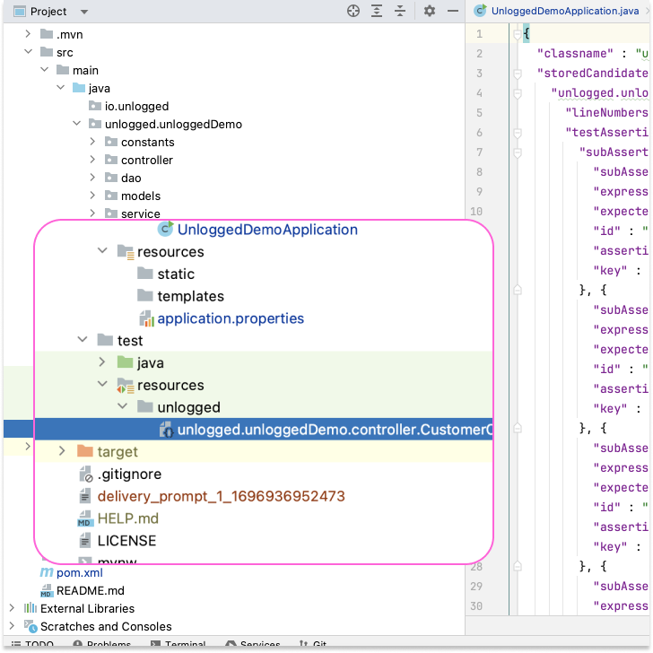

# Saving Candidates

## What's a Candidate? 

When you execute a method using ```Direct Invoke``` or through an http endpoint, you will see the method input values that can be replayed. 

Each unique combination of input and return value is called a Candidate.

!!! tip 
    By default, when you replay a candidate, Unlogged compares the return value object down to the key level. 

But return value may contain ever changing or irrelevant fields such as timestamp. That's where Assertions come in picture.

## Creating Assertions

When you click on **Save Replay** - you will see a window that presents the recorded value of the object for the candidate we just replayed.  


## Defining Assertions

You can define any assertion on this return value, down to any key/value pair. You can define nested assertions with ```AND``` ```OR``` ```NOT``` on different key-value pairs and group them together. 

## Saving the Replays

Replays with assertions are saved at the below location

```/YOUR MODULE DIRECTORY/src/test/resources/unlogged```



!!! nodifference "Replaying with Assertions"
    For your code change, when you replay the candidate, Unlogged will execute the assertion you just saved and inform if the candidate passes or fails the assertions.

## Collaborate

You can now push these replays to your git repository, so that your team members can pull and replay locally for their code changes.